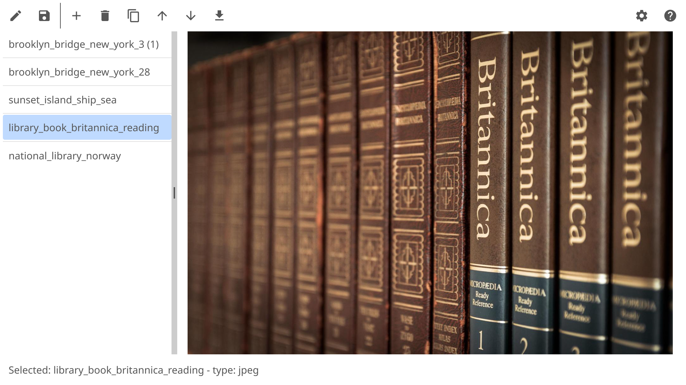

# goimgpack


A simple image packer for combining multiple images into a single file.



## Features

### Export Formats
- Single Image: PNG, JPEG, WebP, GIF, BMP, TIFF
- Multiple Images: ZIP, CBZ, PDF

### Import Formats
- Images: PNG, JPEG, WebP, GIF, BMP, TIFF
- Images in archives: ZIP, CBZ
- Images in PDF
- Images in directories (non-recursive)

### Operations
- Add images
- Duplicate a single image
- Remove a single image
- Reorder a single image
- Save a single image
- Rotate a single image
- Cut a single image into halves

## Packaging the App for Desktop

To package the app for macOS, use the following command:

```bash
fyne package -os darwin
```

## License

This project is licensed under the MIT License. See the [LICENSE](LICENSE) file for details.
